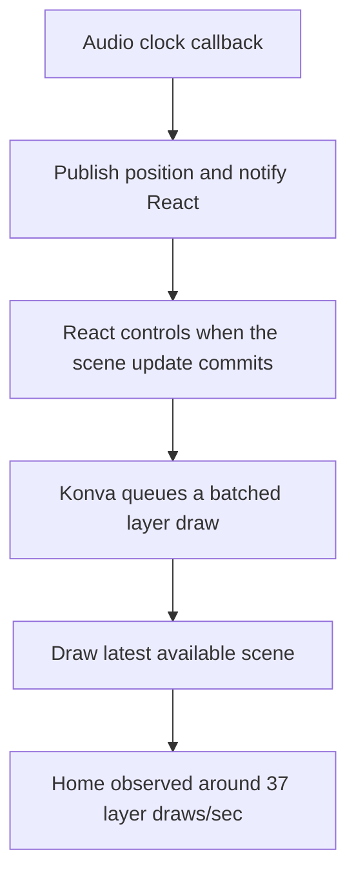
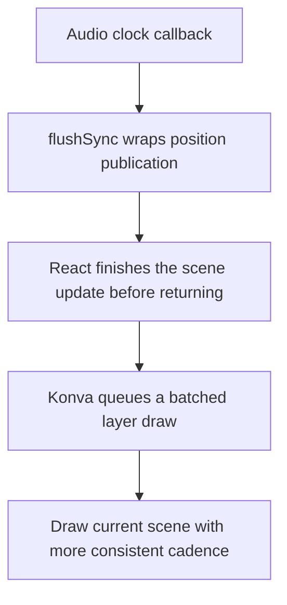

# Playback frame scheduling

Recorded September 7, 2026. This is a maintained explanation of the playback scheduling fix and how to check for regressions.

## Problem and evidence

Home and view-page playback felt less smooth than editor playback, including in fullscreen. Removing the ambient background and replacing the player controls with plain controls did not resolve it. All three pages use `ProjectPreviewSurface`, `LyricPreview`, the shared audio-position store, and the playback-preparation system; the editor is not mounted behind the viewer.

The diagnostic overlay initially showed about 60 `requestAnimationFrame` callbacks per second on both pages. That did not mean the canvases were producing 60 updated pictures per second. Per-layer measurements exposed the difference:

| Measurement from supplied captures | Home | Editor |
| --- | ---: | ---: |
| Recent animation callbacks/sec | 60.0 | 60.0 |
| Audio-position advances/sec, accumulated average | 59.9 | 59.6 |
| Recent light-layer draws/sec | 37.0 | 60.0 |
| Recent animated text-layer draws/sec | 37.0 | 60.0 |
| JavaScript drawing time, ms/sec | 7 | 8 |
| Canvas pixels | 19.62 MP | 21.80 MP |

These captures were not identical-duration traces of the same frame sequence, so they do not establish precise comparative performance. They do show fewer layer redraws on home despite a regularly advancing audio clock. The editor also drew more pixels in this comparison, weakening the earlier explanation based solely on canvas size.

## The change

In [useAudioPosition.ts](../src/Editor/AudioTimeline/useAudioPosition.ts), the shared high-refresh animation callback now calls:

```ts
flushSync(pollHigh);
```

Previously it called `pollHigh()` directly. That function reads the audio position, updates the shared snapshot, and notifies active subscribers when the snapshot changes.

`flushSync`, imported from `react-dom`, requires React to finish the resulting synchronous work before the call returns. This makes the current playback pose available promptly to the React–Konva integration. It does not draw the canvas directly, change the audio rate, or disable Konva's draw batching.

## Before and after

These diagrams illustrate the scheduling explanation supported by the change, not a captured execution trace.





React can combine and schedule updates to avoid unnecessary work. Konva separately combines changes to a layer into a redraw: changing several properties does not require several drawings. If multiple playback poses arrive before a draw, only the latest pose is displayed. The purpose of this fix is to align scene updates with the playback callback, not to preserve every intermediate state at any cost.

The user reported that this change fixed the perceived slowdown. A post-fix 60-draws/sec trace was not recorded in the investigation. The exact reason the editor avoided the slowdown remains unproven; its additional timeline activity may affect scheduling, but that is a hypothesis. This is not evidence of a confirmed React or Konva library defect.

## Regression checks

Enable **Settings → Playback diagnostics → Show performance overlay**. The preference is local to the device and off by default. Disabling it unmounts the probe and stops its measurement work.

1. Compare the same project and passage on home/view and editor, at matching reported canvas dimensions.
2. Reset measurements for each run. Capture the readout during the affected passage or pause immediately afterward.
3. Compare audio-position advances with the animated layers' recent draw rates. A static layer need not redraw at 60 Hz.
4. Check long callback gaps and drawing time separately. Regular callbacks do not prove regular GPU presentation.

Measurements accumulate across pause/resume. Hidden-tab time is excluded. Estimated missed frames use a 60 Hz callback budget; they are not actual compositor/GPU frame-drop counts. Layer draw timings measure synchronous JavaScript drawing work, not total GPU execution time.

Relevant checks:

```sh
yarn check-types
node scripts/tests/audio-seek-events.cjs
node scripts/tests/playback-preparation.cjs
```

The seek test checks that playback subscribers are notified inside the synchronous update boundary. These checks do not establish browser frame cadence; use the overlay for runtime comparison. Keep the synchronous boundary scoped to high-refresh playback updates, since forcing unrelated work to complete synchronously can increase frame cost. Preserve the shared [render preparation](render-preparation.md) lifecycle and cache when changing rendering behavior.
